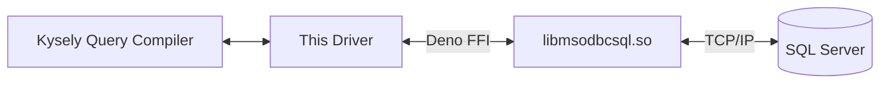

# 🚧 deno-kysely-msodbc (WIP)

> **Native MSSQL support for Kysely on Deno:** Bypass Node.js compatibility
> layers by binding directly to the Microsoft ODBC Driver via Deno FFI.


## 💡 Why?

Currently, connecting Deno to MSSQL requires relying on Deno's Node.js
compatibility layer to run libraries like `npm:mssql` or `npm:tedious`. These
libraries offer no official support for Deno and frequently suffer from
unresolved compatibility issues. While the Deno ecosystem is maturing, native
MSSQL support remains a missing piece.

**This project takes a different approach.**

Instead of using Node.js libraries, we leverage **Deno FFI (Foreign Function
Interface)** to talk directly to the OS-level **Microsoft ODBC Driver**. This
results in a "pure" Deno implementation that interacts with the database at the
C-level.

## Usage

```ts
import { MssqlOdbcDialect } from "./mod.ts";

const dialect = new MssqlOdbcDialect({
  tarn: {
    options: {
      min: 0,
      max: 10,
    },
  },
  odbc: {
    libPath: "/opt/homebrew/lib/libmsodbcsql.18.dylib",
    connString: [
      "driver={ODBC Driver 18 for SQL Server}",
      "server=127.0.0.1",
      "uid=sa",
      "pwd=Test1234$",
      "encrypt=yes",
      "trustServerCertificate=yes",
    ].join(";"),
  },
});

const db = new Kysely()<Database>({ dialect });
```

> **Note:** `--allow-ffi` permission is required.

## Supported SQL Data Types

The following table details how SQL column types are mapped to JavaScript
values.

| SQL Type                                                                                | Internal Binding | JavaScript Type | Notes                                            |
| :-------------------------------------------------------------------------------------- | :--------------- | :-------------- | :----------------------------------------------- |
| **`SQL_INTEGER`**                                                                       | `SQL_C_SLONG`    | `number`        | 32-bit signed integer.                           |
| **`SQL_BIGINT`**                                                                        | `SQL_C_SBIGINT`  | `bigint`        | 64-bit signed integer.                           |
| **`SQL_SMALLINT`**                                                                      | `SQL_C_SSHORT`   | `number`        | 16-bit signed integer.                           |
| **`SQL_TINYINT`**                                                                       | `SQL_C_UTINYINT` | `number`        | 8-bit **unsigned** integer (0-255).              |
| **`SQL_FLOAT`**                                                                         | `SQL_C_DOUBLE`   | `number`        | Double-precision floating point.                 |
| **`SQL_NUMERIC`, `SQL_DECIMAL`**                                                        | `SQL_C_WCHAR`    | `string`        | Fetched as strings to preserve full precision.   |
| **`SQL_BIT`**                                                                           | `SQL_C_BIT`      | `boolean`       | `1` becomes `true`, `0` becomes `false`.         |
| **`SQL_BINARY`, `VARBINARY`, `LONGVARBINARY`**                                          | `SQL_C_BINARY`   | `Uint8Array`    | Returns a copy of the raw binary bytes.          |
| **`SQL_CHAR`, `VARCHAR`, `LONGVARCHAR`**<br>**`SQL_WCHAR`, `WVARCHAR`, `WLONGVARCHAR`** | `SQL_C_WCHAR`    | `string`        | All text types are normalized to UTF-16 strings. |
| **`SQL_TYPE_DATE`, `TIMESTAMP`**                                                        | `SQL_C_WCHAR`    | `string`        | Fetched as text strings (ISO format).            |
| **`NULL`**                                                                              | _N/A_            | `null`          |                                                  |

> **Note:** Any SQL type not listed above will throw an
> `Unsupported SQL dataType` error.

## Architecture


